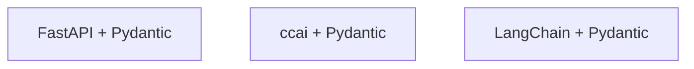

# Pydantic en jamie-oliver-ai — por stack

1. **FastAPI** — Pydantic (`BaseModel`, `Field`) en requests y responses.
2. **`packages/ccai`** — Pydantic en modelos del núcleo del asistente.
3. **LangChain** — Pydantic (`PydanticOutputParser` + modelos `BaseModel`).

