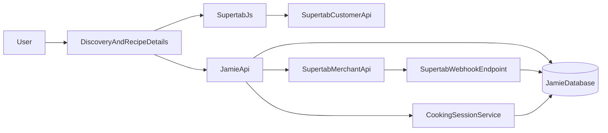
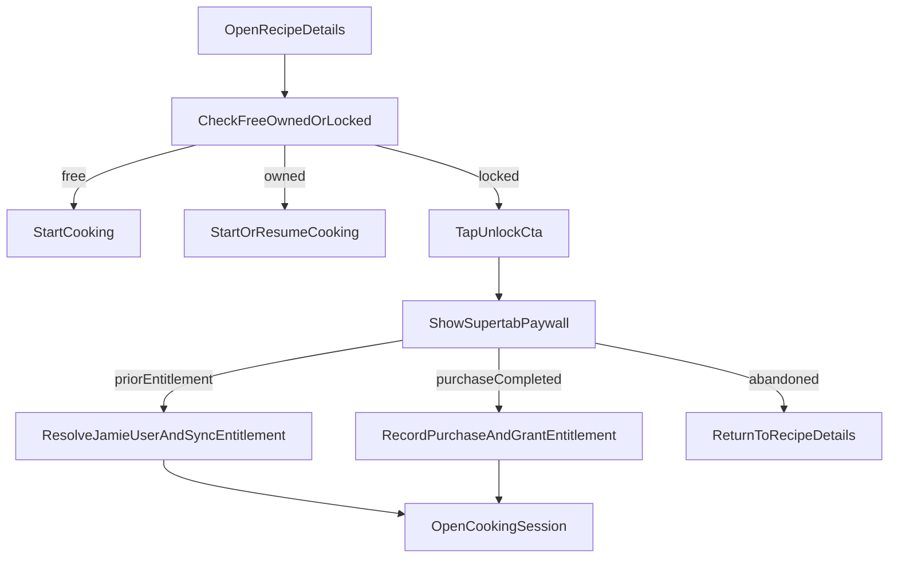

# Supertab Monetization PRD

## Document Status
- Status: Draft for product and design definition
- Product area: Jamie Oliver AI next phase
- Focus: Payments, identity, entitlements, and persistent cooking sessions

## Executive Summary
Jamie Oliver AI currently delivers a strong browse-to-cook experience: users can discover recipes, open recipe details, and enter a voice-guided cooking session. The next phase introduces monetization without adding account friction. Users will be able to browse the full recipe catalog for free, while payment is triggered at the moment they start `Cooking with Jamie` for paid recipes.

Supertab will be the primary external identity and payment layer. Jamie will use Supertab authentication and JWT-backed customer context to avoid a second sign-up flow, then create its own internal user, entitlement, purchase, and cooking-session records. This gives us a commerce-ready foundation for recipe ownership, unlock status, analytics, and durable cooking-session restore.

The recommended rollout is:
1. Keep all recipes browseable.
2. Define a small free set of recipes.
3. Gate paid recipes at the start-cooking CTA in recipe details.
4. Use Supertab paywall flow as the first unlock experience.
5. Persist purchased access and cooking progress server-side.

## Background And Current State
The current product already covers:
- Recipe discovery with chat, search, and browse views.
- Recipe details in an overlay/modal.
- A primary CTA that transitions into `Cooking with Jamie`.
- Voice-guided cooking with timers, step progression, mic state, and local resume behavior.

The current architecture is not yet commerce-aware:
- The frontend gates entry to cooking in [`apps/frontend/src/App.tsx`](../apps/frontend/src/App.tsx).
- The visible start-cooking CTA lives in [`apps/frontend/src/components/RecipeModal.tsx`](../apps/frontend/src/components/RecipeModal.tsx).
- Cooking session continuity is stored in browser `localStorage` in [`apps/frontend/src/components/CookWithJamie.tsx`](../apps/frontend/src/components/CookWithJamie.tsx).
- The database schema is recipe-only today in [`packages/database/prisma/schema.prisma`](../packages/database/prisma/schema.prisma).
- Backend recipe/session services have no user identity or entitlement ownership model today.

This PRD defines the next product layer required to monetize the cooking experience safely and coherently.

## Problem Statement
We need to monetize recipe access without breaking the premium feel of the product or introducing a second authentication flow. The current app has no concept of:
- authenticated Jamie users,
- purchased recipe access,
- owned product catalog,
- durable cooking sessions attached to a real customer,
- or server-side entitlement checks before cooking begins.

At the same time, the product should preserve low-friction browsing and discovery. Users should still be able to explore recipes, understand the value of the experience, and only encounter payment at the moment of commitment.

## Product Goals
- Monetize `Cooking with Jamie` in a way that feels natural and low-friction.
- Keep all recipes browseable, including recipe details.
- Avoid double authentication by treating Supertab as the primary customer identity.
- Persist owned recipes and session progress in Jamie's backend.
- Create a backend model that can support future bundles, subscriptions, and account features.

## Non-Goals
- Building a full Jamie-native auth system separate from Supertab.
- Monetizing discovery/chat itself in this phase.
- Locking the full recipe catalog behind a hard browse paywall.
- Launching social features, favorites, or recipe creation in the same phase.
- Redesigning the entire discovery experience beyond the paid/free states required for monetization.

## Product Principles
- Monetize at commitment, not at curiosity.
- Show value before asking for payment.
- Make identity implicit wherever possible.
- Treat entitlements as a system capability, not just a UI badge.
- Persist progress for paid experiences so ownership feels durable.

## Proposed Product Model

### Access Model
All recipes remain visible in discovery, chat, and recipe details. Recipe access is split into three user-facing states:
- `Free`: user can browse details and start cooking immediately.
- `Locked`: user can browse details, but must unlock before starting cooking.
- `Owned`: user already has entitlement and can start or resume cooking immediately.

### Monetization Moment
The monetization checkpoint is the start-cooking CTA in recipe details. This aligns best with current behavior and user intent because the user has already:
- discovered a recipe,
- opened the details,
- reviewed ingredients/instructions,
- and chosen to commit to the guided experience.

### Freemium Baseline
Launch with a small free sample set:
- 1-2 free recipes available for full cooking access.
- All remaining recipes browsable, but locked at cooking start.

This supports acquisition, evaluation, and habit formation before purchase.

## User Experience Definition

### Discovery And Browse
- Users can browse all recipes in chat, list, and grid experiences.
- Paid recipes show a clear but lightweight lock state or `Paid` badge.
- Free recipes show a `Free` label or no gate marker if the design prefers cleaner cards.
- Discovery should not force sign-in or payment.

### Recipe Details
Recipe details become the primary monetization surface.

Required CTA states:
- `Start Cooking` for free recipes.
- `Unlock to Start Cooking with Jamie` for locked recipes.
- `Continue Cooking` for recipes with an active owned session.
- `Start Cooking Again` or equivalent for owned recipes without an active session.

Supporting UI states:
- Clear ownership badge for already-purchased recipes.
- Optional price display for locked recipes.
- Lightweight explanation of what unlock includes:
  - voice-guided cooking,
  - timers,
  - progress tracking,
  - session restore.

### Purchase UX
The user should not experience a separate Jamie account creation step before purchase.

Expected flows:
- If the user is unauthenticated with Supertab, the paywall handles login/authentication.
- If the user already has prior entitlement, the app skips purchase and enters cooking.
- If the user purchases successfully, the app grants access and continues into cooking.
- If the user abandons the paywall, the app returns them to recipe details without losing context.

### Persistence UX
For authenticated owned recipes:
- Cooking sessions are tied to the Jamie user record linked to Supertab identity.
- The user can leave and return later.
- The app restores current step, completed steps, timer state, and session freshness.
- The app should communicate clearly whether a session is active, paused, expired, or completed.

## Customer Journeys

### Journey 1: Browse A Free Recipe And Start Cooking
1. User opens discovery or chat.
2. User opens a free recipe.
3. Recipe details show `Start Cooking`.
4. User enters cooking immediately.
5. Progress is persisted to the Jamie backend if authenticated, or to local fallback if not yet authenticated.

### Journey 2: Browse A Paid Recipe And Unlock At Start Cooking
1. User discovers a paid recipe and opens recipe details.
2. User sees full details and a locked cooking CTA.
3. User taps `Unlock to Start Cooking with Jamie`.
4. Supertab paywall launches.
5. If user needs login, Supertab handles it.
6. If purchase completes, Jamie verifies or records the entitlement and enters cooking.

### Journey 3: Returning User With Prior Entitlement
1. User opens a previously purchased recipe.
2. App checks entitlement via Supertab/Jamie state.
3. CTA resolves directly to owned state.
4. User starts or resumes cooking without seeing the paywall.

### Journey 4: Resume An In-Progress Paid Session
1. User returns later to a recipe they already own.
2. App sees a durable active session linked to that recipe and user.
3. Recipe details show `Continue Cooking`.
4. Cooking session restores the latest valid snapshot and timers policy.

## Identity Strategy

### Principle
Supertab is the primary external identity provider. Jamie becomes the internal product identity and data owner.

### Authentication Model
Use Supertab auth/session handling in-browser to avoid custom OAuth implementation where possible. Supertab docs explicitly recommend using Supertab.js for authentication and Customer API access, with token refresh managed by the SDK:
- [Customer API Authentication](https://docs.supertab.co/customer-api/authentication.md)
- [Supertab.auth](https://docs.supertab.co/supertab-js/reference/auth.md)

### Jamie Identity Layer
On first successful Supertab-authenticated interaction, Jamie creates or links:
- a `User` record,
- a `SupertabIdentity` or equivalent external identity row,
- and any initial purchase or entitlement rows available at that moment.

Jamie remains the source of truth for:
- owned recipes,
- purchased offerings,
- cooking-session history,
- and product analytics.

### Recommended Identity Contract
- Frontend obtains Supertab-authenticated state using Supertab.js.
- Frontend sends Jamie the authenticated proof/session token required for backend verification.
- Jamie verifies the Supertab token or uses a trusted exchange mechanism.
- Jamie resolves a stable internal user ID.
- All future entitlement and session calls are attached to the Jamie user.

## Entitlement And Product Model

### Product Strategy
The monetized unit in this phase is the guided cooking experience for a recipe.

Recommended initial product abstraction:
- `RecipeOffering`: unlocks `Cooking with Jamie` for one recipe.

Future-compatible extensions:
- category bundles,
- chef packs,
- promotional unlocks,
- subscriptions or time-based passes.

### Entitlement Strategy
Jamie should treat entitlements as first-class internal records even if Supertab also manages customer entitlement. This avoids over-coupling product behavior to a single external provider and supports:
- resume logic,
- ownership badges,
- internal analytics,
- customer support,
- and future migrations.

Recommended effective entitlement states:
- `active`
- `pending`
- `expired`
- `revoked`

### Content Key Mapping
Each paid recipe should map deterministically to a Supertab `content_key` or offering metadata value so that:
- prior entitlement checks are reliable,
- purchases can be joined back to recipes,
- and backend unlock logic stays stable over time.

Supertab entitlement and customer endpoints support this model:
- [Retrieve entitlement status](https://docs.supertab.co/customer-api/endpoints/retrieve-entitlement-status.md)
- [Retrieve current customer](https://docs.supertab.co/customer-api/endpoints/retrieve-customer.md)

## Data Model Proposal

### New Core Tables
Add the following models in Prisma:

#### `User`
- `id`
- `createdAt`
- `updatedAt`
- `email`
- `firstName`
- `lastName`
- `displayName`
- `isGuest`
- `status`

#### `ExternalIdentity`
- `id`
- `userId`
- `provider` (`supertab`)
- `externalSubjectId`
- `accessTokenLastSeenAt`
- `refreshTokenStored` flag only if Jamie stores it
- `rawProfile` JSON
- `createdAt`
- `updatedAt`

#### `RecipeOffering`
- `id`
- `recipeId`
- `supertabOfferingId`
- `supertabExperienceId`
- `contentKey`
- `priceAmount`
- `currencyCode`
- `status`
- `isFree`
- `metadata`

#### `Purchase`
- `id`
- `userId`
- `recipeOfferingId`
- `provider` (`supertab`)
- `providerPurchaseId`
- `providerOfferingId`
- `status` (`pending`, `completed`, `abandoned`, `refunded`)
- `priceAmount`
- `currencyCode`
- `purchasedAt`
- `completedAt`
- `paymentRequired`
- `providerPayload`
- `metadata`

#### `Entitlement`
- `id`
- `userId`
- `recipeId`
- `purchaseId`
- `provider`
- `providerContentKey`
- `status`
- `grantedAt`
- `expiresAt`
- `recursAt`
- `source`

#### `CookingSession`
- `id`
- `userId`
- `recipeId`
- `entitlementId`
- `status` (`active`, `paused`, `completed`, `abandoned`, `expired`)
- `currentStepIndex`
- `completedStepIds` JSON
- `timerState` JSON
- `snapshotVersion`
- `startedAt`
- `lastActiveAt`
- `pausedAt`
- `completedAt`

#### Optional `CookingSessionEvent`
- append-only event log for debugging, replay, or audit

### Why This Model
- Keeps Jamie in control of product access and supportability.
- Supports both provider-managed and Jamie-managed entitlement strategies.
- Allows direct joins from recipe -> offering -> purchase -> entitlement -> session.
- Gives product and support teams a durable customer record independent of frontend storage.

## Architecture Overview

## Proposed System Flow

### Paywall-On-CTA Recommended Flow

## API And Service Contracts To Define

### Frontend-To-Jamie
- `POST /api/auth/supertab/session`
  - verify or exchange Supertab-authenticated context
  - create/link Jamie user
  - return Jamie session/user payload
- `GET /api/me`
  - current Jamie customer, entitlements summary, active sessions
- `GET /api/recipes/:slug/access`
  - return `free|locked|owned`, active session summary, offering info
- `POST /api/recipes/:slug/purchase/sync`
  - sync purchase completion or prior entitlement from Supertab result payload
- `POST /api/cooking/sessions`
  - create or resume a cooking session for an entitled recipe
- `GET /api/cooking/sessions/:id`
  - restore durable cooking snapshot
- `POST /api/cooking/sessions/:id/pause`
- `POST /api/cooking/sessions/:id/resume`

### Jamie-To-Supertab
- Verify customer status and entitlement when needed.
- Optionally create or look up offerings if using dynamic one-time offerings.
- Consume merchant webhooks to finalize purchases and reconcile pending states.

### Webhooks
Add a public webhook endpoint to accept Supertab merchant events and verify signatures. Supertab recommends webhook-driven processing and uses Svix-managed signatures:
- [Consuming Webhooks](https://docs.supertab.co/merchant-api/webhooks/consuming-webhooks.md)

## Integration Option Comparison

### Option A: Embedded Purchase Button In Recipe Details
Use `createPurchaseButton` directly inside the recipe modal and render the button in place of the current CTA for locked recipes.

Pros:
- Clear visible purchase affordance.
- Low ambiguity about what happens next.
- Works well if pricing and merchandising need to be persistent on the page.

Cons:
- Slightly more commerce-forward and heavier in the recipe UI.
- Less aligned with the exact natural commitment moment if the user just wants to cook immediately.
- May require extra surrounding UX to handle prior entitlement, identity, and purchase states gracefully.

### Option B: Paywall Triggered By Start-Cooking CTA
Keep one primary CTA and launch the paywall only when the user tries to start cooking.

Pros:
- Best match with the intended monetization moment.
- Preserves clean recipe-details UX.
- Minimizes premature friction and avoids making recipe details feel like a storefront.
- Fits current product architecture cleanly because start-cooking is already centralized.

Cons:
- Less explicit upfront purchase affordance.
- Requires clearer CTA copy and maybe price messaging nearby.

### Option C: Hybrid
Show a monetized CTA state in recipe details and use paywall on click, while optionally rendering a purchase button or supporting element in secondary positions.

Pros:
- Most flexible.
- Supports both clear commerce messaging and clean primary flow.
- Best long-term model once product pricing/merchandising evolves.

Cons:
- More design complexity.
- Easier to create duplicated affordances if not carefully designed.

### Recommendation
For MVP, use **Option B with a light hybrid wrapper**:
- Primary action remains a single CTA in recipe details.
- For locked recipes, CTA copy changes to `Unlock to Start Cooking with Jamie`.
- Clicking the CTA launches the Supertab paywall.
- If design needs a more visible monetization treatment, add secondary purchase messaging, not a second competing primary button.

Use the purchase-button experience later if:
- product wants a more persistent pricing CTA,
- bundles or promotions need explicit merchandised placement,
- or chat/discovery cards begin offering direct unlock actions.

## Persistence Strategy

### Current State
The app currently saves session continuity to browser `localStorage`, including:
- current step,
- completed steps,
- timer state,
- and a 24-hour local restore window.

This is not sufficient for paid ownership because it is:
- device-local,
- unauthenticated,
- not supportable,
- and not durable across browsers or devices.

### Target State
Paid and owned cooking sessions must become backend-owned records tied to the Jamie user.

Required capabilities:
- create or resume session by user + recipe,
- store current snapshot on critical changes,
- restore across devices,
- define pause semantics,
- define timer restore semantics,
- preserve last active time and expiry policy.

### Timer Policy
The PRD should standardize one behavior for pause:
- recommended default: pause timers when a session is explicitly paused,
- continue timers when the user simply closes the browser only if product explicitly wants real-world elapsed behavior.

For MVP, prefer clearer user trust over realism:
- explicit pause freezes timers,
- background abandonment without pause rehydrates using elapsed wall-clock logic only when a timer was actively running.

## Analytics And Observability
Track at minimum:
- recipe viewed
- locked recipe viewed
- unlock CTA tapped
- paywall shown
- paywall abandoned
- prior entitlement detected
- purchase pending
- purchase completed
- entitlement granted
- cooking session created
- cooking session resumed
- cooking session paused
- cooking session completed

Correlate by:
- internal user ID
- Supertab external subject ID
- recipe ID
- offering ID
- purchase ID
- cooking session ID

## Rollout Plan

### Phase 1: Foundations
- Add data model for users, identities, offerings, purchases, entitlements, and cooking sessions.
- Add Jamie auth/session bootstrap from Supertab context.
- Add recipe access state endpoint.

### Phase 2: Monetized Start-Cooking Flow
- Add free vs locked recipe presentation.
- Add entitlement-aware recipe details CTA.
- Add Supertab paywall launch on locked CTA.
- Add purchase/prior-entitlement sync into Jamie.

### Phase 3: Durable Session Persistence
- Move cooking-session restore from local-only storage into the backend.
- Add authenticated resume, pause, and restore.
- Reconcile timer behavior and session expiry rules.

### Phase 4: Commerce Supportability
- Add webhook ingestion and reconciliation.
- Add customer support/admin visibility into purchases, entitlements, and session ownership.
- Add analytics dashboards and funnel monitoring.

## Risks
- Identity ambiguity if Supertab auth state and Jamie user mapping drift.
- Customer confusion if browseable details imply access that is later denied without clear messaging.
- Payment success but entitlement sync failure.
- Session restore complexity if timers and step state drift between frontend and backend logic.
- Overcoupling the product to one provider if Jamie does not retain internal entitlement records.

## Design Questions To Resolve
- Which exact recipes are free at launch?
- How is price displayed on locked recipe details?
- Should paid recipes show locked state in search/chat cards or only in details?
- How much of ingredients and steps are visible before purchase?
- Is ownership expressed as `Owned`, `Unlocked`, or left implied in the CTA?
- Should resume state appear in recipe cards as well as details?
- What copy best explains the value of paid cooking without making the app feel transactional?

## Product Decisions Recommended In This PRD
- All recipes remain browsable.
- Payment is required at the start-cooking moment for paid recipes.
- Supertab is the upstream identity provider; Jamie owns user, entitlement, purchase, and session records internally.
- Paid sessions are durable and restore across visits for authenticated users.
- Start with paywall-on-CTA, not an always-visible purchase button as the primary flow.

## Source References
- Current cooking entry point: [`apps/frontend/src/App.tsx`](../apps/frontend/src/App.tsx)
- Current recipe-details CTA: [`apps/frontend/src/components/RecipeModal.tsx`](../apps/frontend/src/components/RecipeModal.tsx)
- Current local session persistence: [`apps/frontend/src/components/CookWithJamie.tsx`](../apps/frontend/src/components/CookWithJamie.tsx)
- Current recipe-only schema: [`packages/database/prisma/schema.prisma`](../packages/database/prisma/schema.prisma)
- Current session service: [`apps/backend-voice/src/services/session_service.py`](../apps/backend-voice/src/services/session_service.py)
- Current recipe access service: [`apps/backend-voice/src/services/recipe_service.py`](../apps/backend-voice/src/services/recipe_service.py)
- Supertab overview: [About Supertab](https://docs.supertab.co/supertab-introduction/overview/about-supertab)
- Supertab auth: [Customer API Authentication](https://docs.supertab.co/customer-api/authentication.md)
- Supertab browser auth: [Supertab.auth](https://docs.supertab.co/supertab-js/reference/auth.md)
- Paywall flow: [Paywall Experiences](https://docs.supertab.co/supertab-js/experiences/paywall.md)
- Purchase button: [Supertab.createPurchaseButton](https://docs.supertab.co/supertab-js/reference/purchase-button.md)
- Entitlements: [Retrieve entitlement status](https://docs.supertab.co/customer-api/endpoints/retrieve-entitlement-status.md)
- Customer profile and tab: [Retrieve current customer](https://docs.supertab.co/customer-api/endpoints/retrieve-customer.md)
- Merchant webhook model: [Consuming Webhooks](https://docs.supertab.co/merchant-api/webhooks/consuming-webhooks.md)
- Custom integrations: [Custom Integrations](https://docs.supertab.co/supertab-integrate/custom-integrations.md)
