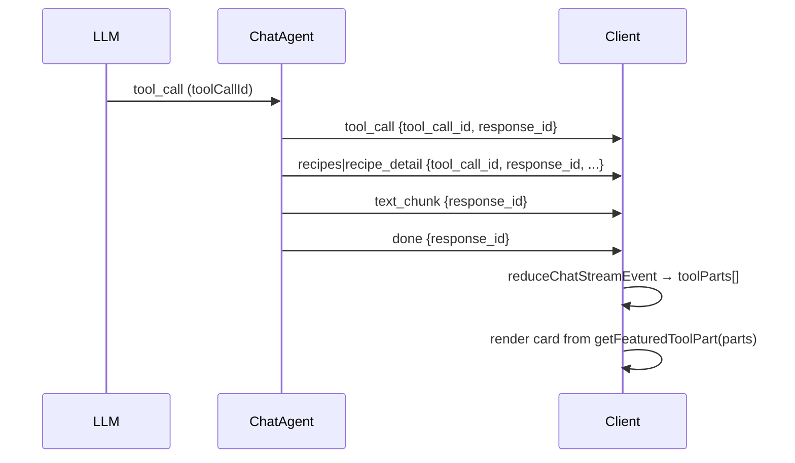

# Discovery tool contract

Discovery chat (SSE `/api/v1/chat`) and voice (`/ws/chat-voice`) share one **tool-usage contract**. Cards are bound to the tool invocation that produced them — not inferred from stale message fields or global priority rules.

## Source of truth

| Layer | Rule |
|-------|------|
| **Catalog** | Only `recipes.status = 'published'` slugs from Supabase. Local JSON bundles are for ingest/seed only. |
| **Tools** | `search_recipes`, `get_recipe_details`, `request_supertab_unlock` reject or filter unknown slugs. |
| **Stream** | Every structured payload includes `metadata.tool_call_id` + `metadata.response_id`. |
| **UI** | Frontend reducer builds `message.toolParts[]`; featured card = latest card-bearing part in the turn. |

## Event flow

## Wire events (legacy names, enriched metadata)

| Event | Purpose |
|-------|---------|
| `text_chunk` | Streaming Jamie prose |
| `tool_call` | Tool invocation started |
| `recipes` / `recipe_detail` / `meal_plan` / `shopping_list` | Tool output for UI |
| `recipe_paywall_requested` | Unlock checkout signal (+ `recipe_detail` from same toolCallId when valid) |
| `done` | Turn complete |

## Development workflow

1. **Seed/publish** recipes via pipeline → Supabase `recipes` table (`published`).
2. **Run** `scripts/smoke-discovery.py` before and after changes; save baseline with `--save baseline.json`.
3. **Do not** rely on `data/recipes/*.json` or `public/recipes-json` at runtime.
4. **Verify** slugs from search exist: `GET /api/v1/recipes/{slug}` → 200; non-catalog e.g. `fish-tacos` → 404.

## Manual QA checklist (PR)

- [ ] Text search: card matches recipes Jamie mentions
- [ ] Text: "let's see the X" opens correct carousel recipe
- [ ] Voice: no stale card from previous turn
- [ ] Voice: thinking bubble while forming
- [ ] Unlock: card matches recipe Jamie names
- [ ] Console: no 404 access spam
- [ ] Published recipes open modal + cook flow

## Key files

- Backend: `recipe_catalog.py`, `tool_result_events.py`, `chat_agent.py`
- Frontend: `lib/chatStream.ts`, `components/ChatView.tsx`, `lib/voiceRichCard.ts`
- Smoke: `scripts/smoke-discovery.py`
