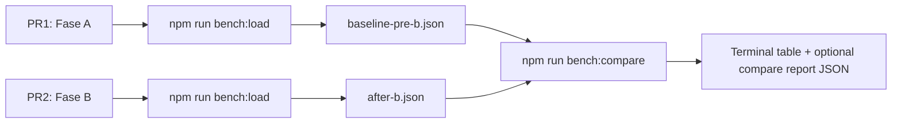
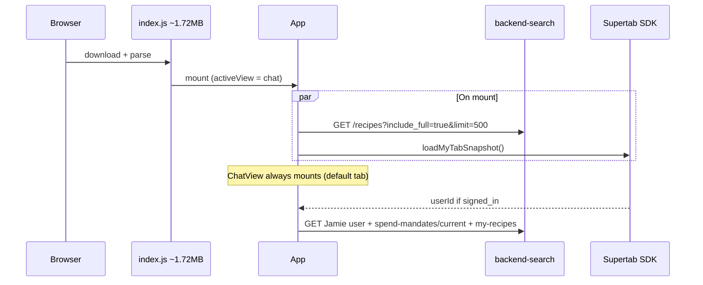

# Plan: latency on load (NEU-629)

Parent: [NEU-629](https://linear.app/neuforce/issue/NEU-629/latency-on-load-some-testing-on-start) · **Priority:** Urgent · **Assignee:** Mario Restrepo

**Ticket ask:** investigate and reduce latency on initial app load; profile startup performance; add test coverage for load-time benchmarks.

## Delivery model: two PRs, automated measurements

Measurements are **not manual**. No DevTools clicks, no human interaction with the app during benchmarks.



| PR | Scope | Human QA |
|----|--------|----------|
| **PR1** | Instrumentation + bench scripts + Vitest | Optional smoke only |
| **PR2** | Lightweight recipes + skeleton + hydration | Automated bench + functional checklist for modal/cook |

## Product decisions (defaults)

| # | Topic | Decision for v1 | Rationale |
|---|--------|-----------------|-----------|
| 1 | How we measure | **`npm run bench:load`** — headless Chromium, scripted navigation | Reproducible; no interaction bias |
| 2 | When we measure | **After PR1** (baseline) and **after PR2** (after) — same script, same flags | Clean before/after |
| 3 | Who compares JSON | **`npm run bench:compare`** — script diffs the two files | Not manual spreadsheet; agent/dev only runs the command |
| 4 | Definition of “ready” | Stages: `chat_shell_ready`, `recipes_ready`, `recipes_first_card` (Recipes route) | Matches default tab + Recipes surface |
| 5 | Bench data source | Default **`bench:load:local`** — `VITE_ALLOW_LOCAL_RECIPES=true` + `/recipes-json/` | Stable without backend; optional `bench:load:api` for integration |
| 6 | Target numbers | Provisional **A &lt; 3s**, **B &lt; 5s** — tune after first `baseline-pre-b.json` | Not blocking until baseline exists |

## Technical context (current state)

### Startup chain today



### Known bottlenecks (prioritized)

| Priority | Issue | Impact |
|----------|--------|--------|
| **P0** | `include_full=true&limit=500` in [`recipeLoader.ts`](../../apps/frontend/src/data/recipeLoader.ts) | Large payload + parse — **fixed in PR2** |
| **P1** | Single JS chunk ~1.72 MB | Slow TTI — Phase C |
| **P1** | Hero PNG ~1.08 MB | LCP — Phase C |
| **P2** | Supertab + mandate on mount | Extra requests — Phase C |

### Bundle snapshot (local prod build, main @ 2026-06)

| Asset | Size | gzip |
|-------|------|------|
| `index-*.js` | 1.72 MB | 534 KB |
| `sentry-*.js` | 213 KB | 70 KB |
| Hero PNG | 1.08 MB | — |

---

## Phase A — PR1: measure (no behavior change)

### A1. `appLoadMetrics.ts`

- `startAppLoadSession()` on first `App` mount.
- `markAppLoadStage(stage, extra?)` — idempotent; logs `[app-load] { stage, totalMs, ... }`.
- `getAppLoadReport()` — snapshot for scripts.
- On session complete (or idle timeout), set `window.__APP_LOAD_REPORT__` for headless collection.

**Stages v1:**

| Stage | Trigger |
|-------|---------|
| `app_mount` | `App` first render committed |
| `recipes_ready` | `initializeRecipes()` resolved |
| `chat_shell_ready` | `data-testid="chat-shell"` visible (chat route) |
| `recipes_route_ready` | `data-testid="recipes-view"` visible after `goto('/recipes')` |
| `recipes_first_card` | First `[data-testid="recipe-card"]` visible (bench navigates to `/recipes`) |
| `mytab_ready` | Optional diagnostic only — **excluded from compare SLO** |

**Wire in:** [`App.tsx`](../../apps/frontend/src/App.tsx), minimal `data-testid` on chat shell and recipes container.

### A2. Automated benchmark — `scripts/bench-load.mjs`

**No human interaction.** The script:

1. `vite build` (with bench env: local recipes, Supertab routes stubbed).
2. Starts `vite preview` on ephemeral port.
3. Launches Playwright Chromium **headless**.
4. **Run A (chat):** fresh context → `page.goto('/')` — wait for `chat-shell` + `chat_shell_ready` + `recipes_ready`.
5. **Run B (recipes):** fresh context → `page.goto('/recipes')` — wait for `recipes_first_card` (avoids losing chat stages on full reload).
6. Merge A+B stage medians into one report per run.
6. Records Navigation Timing, list API URL + response size (from network events).
7. Repeats `--runs N` (default 5), drops run 1 (cold JIT), outputs **median**.
8. Writes JSON to `benchmarks/<output>.json` (default timestamped; `--out baseline-pre-b` for named file).
9. Stops preview server.

**Stubbing (reproducibility):**

- Playwright `route()` blocks or mocks Supertab SDK hosts and `spend-mandates` so bench does not depend on signed-in session or external network.

**npm scripts:**

```bash
npm run bench:load                              # → benchmarks/bench-<timestamp>.json
npm run bench:load -- --out baseline-pre-b      # named baseline (before PR2)
npm run bench:load -- --out after-b --runs 5    # after PR2
npm run bench:load:api                          # same but VITE_API_BASE_URL + real backend
```

**Dev dependency:** `playwright` (Chromium only for this script; not a full E2E suite in v1).

### A3. Compare — `scripts/bench-compare.mjs`

**Compares two JSON files automatically** — no manual table editing.

```bash
npm run bench:compare -- benchmarks/baseline-pre-b.json benchmarks/after-b.json
```

Output (stdout):

- Side-by-side median ms per stage (`recipes_ready`, `chat_shell_ready`, `recipes_first_card`, …).
- Delta ms and % improvement per stage.
- List API payload KB before/after (validates PR2).
- Exit code 0 always in v1 (report only); optional `--fail-if-regression` later.

Also writes `benchmarks/compare-pre-b-vs-after-b.json` for PR description / Linear paste.

**Who runs compare?** Developer or CI after both JSON exist. The Cursor agent can run the same command when implementing PR2 and paste the stdout into the PR — **not** by watching a live browser session.

### A4. Vitest — `appLoadMetrics.test.ts`

Unit tests only: stage ordering, monotonic `totalMs`, once semantics, report shape. Does **not** replace `bench:load`.

### A5. Artifacts layout

```
apps/frontend/benchmarks/
  .gitkeep
  baseline-pre-b.json    # generated; commit optional (recommended: commit for PR2 diff in repo)
  after-b.json
  compare-pre-b-vs-after-b.json
```

Add `benchmarks/bench-*.json` to `.gitignore` if timestamps are noisy; **keep named** `baseline-pre-b.json` / `after-b.json` committed or attached to PR2.

---

## Phase B — PR2: reduce latency

### B1. Lightweight recipe catalog (P0)

[`recipeLoader.ts`](../../apps/frontend/src/data/recipeLoader.ts):

1. `GET /api/v1/recipes?limit=500` — **no** `include_full`.
2. Map summary fields to card-level `Recipe` without `rawRecipePayload` / `backendSteps`.
3. Hydrate on demand via [`loadRecipeBySlug`](../../apps/frontend/src/data/loadRecipeBySlug.ts) / `getRecipeById` for modal, cook, voice, permalinks.

### B2. Recipes skeleton

[`App.tsx`](../../apps/frontend/src/App.tsx): skeleton while `loadedRecipes.length === 0` and fetch in flight; not confused with empty catalog.

### B3. Post-PR2 benchmark

```bash
cd apps/frontend
npm run bench:load -- --out after-b
npm run bench:compare -- benchmarks/baseline-pre-b.json benchmarks/after-b.json
```

Paste compare output into PR2 description. **Success signal for PR2:** meaningful drop in `recipes_ready` ms and `recipes_list_kb` — not necessarily hitting provisional SLO yet.

---

## Phase C — follow-up (out of NEU-629 v1)

Lazy `CookWithJamie`, hero PNG, defer Supertab/mandate, Vite `manualChunks`.

---

## Files to change

### PR1

| File | Change |
|------|--------|
| `src/lib/appLoadMetrics.ts` | New |
| `src/lib/appLoadMetrics.test.ts` | New |
| `src/App.tsx` | Wire metrics + testids |
| `scripts/bench-load.mjs` | New — automated load bench |
| `scripts/bench-compare.mjs` | New — diff two JSON reports |
| `package.json` | `bench:load`, `bench:compare`, `playwright` devDep |
| `benchmarks/.gitkeep` | New |
| `.gitignore` | Optional pattern for timestamped bench JSON |

### PR2

| File | Change |
|------|--------|
| `src/data/recipeLoader.ts` | Lightweight list |
| `src/App.tsx` | Skeleton + hydration touchpoints |
| Modal / cook paths | Hydrate before full payload required |

---

## Functional QA (PR2 only — not part of automated bench)

Automated bench does **not** click modal or cook. After PR2, quick human or future Playwright test:

- [ ] Recipe modal opens with hydrated steps
- [ ] Cook with Jamie works
- [ ] `/recipe/:slug` permalink works
- [ ] Supertab commerce unchanged

---

## Success criteria for closing NEU-629

- [ ] PR1 merged: `appLoadMetrics` + `bench:load` + `bench:compare` + Vitest
- [ ] `baseline-pre-b.json` captured with PR1 codebase (before PR2)
- [ ] PR2 merged: lightweight catalog + skeleton + hydration
- [ ] `after-b.json` + `bench:compare` shows improvement on `recipes_ready` and list payload KB
- [ ] Compare summary in PR2 or Linear
- [ ] No regression in commerce/cook (functional QA)

---

## Example compare output (illustrative)

```
App load benchmark comparison
  baseline: benchmarks/baseline-pre-b.json  (median of 4 runs)
  after:    benchmarks/after-b.json

Stage                  Before    After     Δ        Δ%
recipes_ready          2840 ms   620 ms    -2220    -78%
chat_shell_ready       890 ms    880 ms    -10      -1%
recipes_first_card     3100 ms   940 ms    -2160    -70%
recipes_list_kb        8420      180       -8240    -98%

Wrote benchmarks/compare-pre-b-vs-after-b.json
```

---

## References

- [NEU-629](https://linear.app/neuforce/issue/NEU-629/latency-on-load-some-testing-on-start)
- [`GET /api/v1/recipes`](../../apps/backend-search/recipe_search_agent/api.py) — `include_full` default `false`
