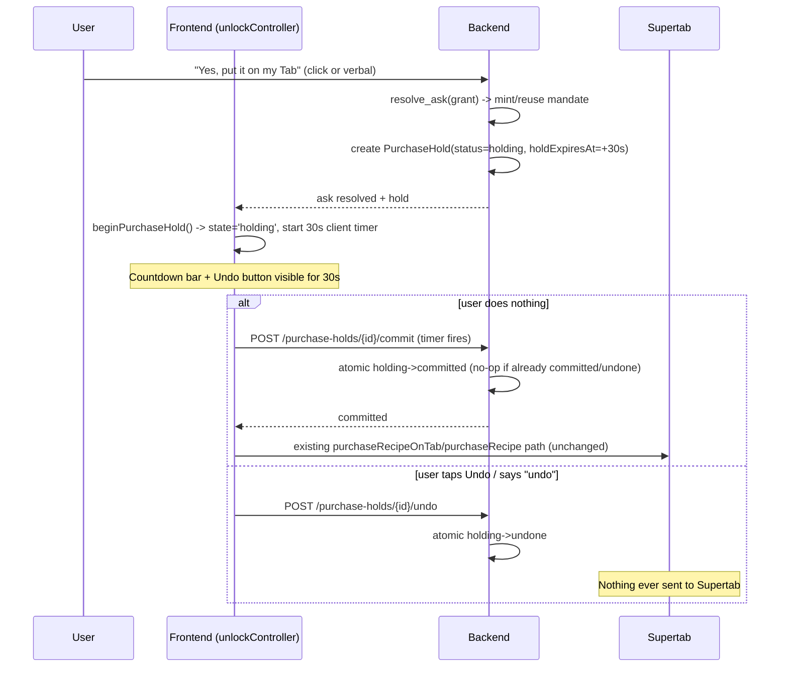

# Plan: Agentic approval & 30s purchase-hold undo window (NEU-672)

**Ticket:** [NEU-672](https://linear.app/neuforce/issue/NEU-672) — 30s undo window
**Related:** [NEU-673](https://linear.app/neuforce/issue/NEU-673) — trust hardening (verified token)
**Branch:** `feat/agentic-approval-undo-window`

## TL;DR

Two things shipped together because they share one root cause: the codebase had
**no generic contract** for "the agent is about to do something that costs money or
is otherwise irreversible" — approval and execution were the same step, and nothing
recorded *how* a decision was made (click vs. verbal, channel, standing-mandate vs.
one-off). This plan:

1. Introduces `AgentActionReceipt` — one auditable record shape for every
   accept/decline/cancel decision, chat or voice, interactive or auto-charged
   (MCP elicitation + AP2 mandate-receipt vocabulary, not invented from scratch).
2. Splits **authorization** from **execution** for the Supertab purchase step by
   inserting a 30-second server-held `PurchaseHold` (`holding → committed | undone`)
   between "user said yes" and "money actually moves," with a client-driven
   countdown + Undo affordance in both chat and voice.
3. (PR5) Applies the shared Framer Motion primitives introduced for the countdown
   card to the two other known rough-edge transitions (`VoiceModeRoller` collapse,
   recipe-card commerce badge) so the new, more-stateful card doesn't repeat the
   "collapse capsule didn't collapse" bug class.

## What shipped (PR1–PR4, merged)

| PR | Layer | What |
|---|---|---|
| #97 (PR1) | Backend | `agent_action_receipts.py` vocabulary (`AgentActionKind`, `ApprovalOutcome`, `AgentActionReceiptInput`); `resolve_ask` gains `channel`/`decision_detail`; auto-charge path now also writes a receipt. Migration `0008_agent_action_receipts`. |
| #98 (PR2) | Frontend | `request_supertab_unlock` joins the same `ProcessStep` narration timeline as read tools (chat + voice); auto-charge is narrated ("using your standing approval up to $X") instead of silent. |
| #99 (PR3) | Backend | `PurchaseHold` FSM (`holding`/`committed`/`undone`/`failed`) with atomic compare-and-swap transitions; `GET/commit/undo` endpoints; voice "undo"/"cancel that" pre-LLM interception (`undo_intent.py`). Migration `0009_purchase_holds`. |
| #100 (PR4) | Frontend | `holding`/`undone` states in `commerceStore`/`unlockController`; controller-owned (not component-owned) client-driven 30s auto-commit timer with generation-guarded cancellation; countdown + Undo UI in `SpendMandateConsentInline`; shared `design-system/motion.ts` primitives; voice `purchase_hold_resolved` sync. |

Both database migrations (`0008`, `0009`) are applied on the beta Supabase project.

### Architecture: authorization vs. execution

Key property: **the actual Supertab purchase mechanics
(`supertab.ts::purchaseRecipe`/`purchaseRecipeOnTab`) were never touched.** The hold
only changes *when* that call happens (delayed by ≤30s), never *how*. Every
fallback path (hold creation fails, hold response is malformed) degrades to the
pre-PR3/4 behavior — immediate purchase, no hold — so a broken hold can never mean
"money moves with zero visibility" nor "approved money silently never moves."

### Timer ownership model

The 30s auto-commit timer lives in a module-level map inside
`unlockController.ts`, keyed by recipe id, with a generation counter per recipe so
a stale timer that fires after an undo (or a superseding hold) becomes a safe
no-op instead of double-committing. The on-screen countdown in
`SpendMandateConsentInline` is a **separate, purely cosmetic** `setInterval` — it
never drives the actual commit; it only reads `holdExpiresAt` to render remaining
time. This split matters: even if the component unmounts/remounts (e.g. the card
scrolls off-screen), the authoritative timer keeps running.

### Idempotency

Every transition (`commit`, `undo`) is a single atomic `UPDATE ... WHERE status =
<expected>` (`PurchaseHoldRepository.claim_hold_transition`), mirroring the
pre-existing `mandate_consumed_at` one-time-consumption pattern. Racing a client
auto-commit against a same-instant "undo" always resolves to exactly one winner;
the loser's API call returns a `409` (`already_committed` / `already_undone`) that
the frontend treats as a benign, already-resolved race rather than an error.

## Known limitation (accepted trade-off, not a bug)

**If the browser tab/app is closed or reloaded during the 30-second hold window,
the client-driven auto-commit timer is lost and the hold is never touched again.**
There is no server-side cron/scheduler committing expired holds (matching this
codebase's existing "lazy expiry on next touch" style, e.g. `ASK_TTL_MINUTES`) —
a hold only advances past `holding` when a client calls `commit` or `undo`, or
when some other request happens to touch it (e.g. a manual `GET`).

Practically: a user who approves a purchase and then immediately closes the tab
within 30s will find the recipe still locked and never charged, even though they
said yes. This was a deliberate choice consistent with this project's money-safety
priority — the failure mode is "approved-but-not-charged" (silently safe, requires
the user to re-approve) rather than "charged-without-final-visibility." If this
needs closing, the follow-up (tracked loosely under NEU-673 trust hardening,
not yet a committed scope item here) would be either (a) a lightweight resume-on-
load check (`GET /purchase-holds?session_id=...` for an open hold and resume the
countdown), or (b) a server-side sweep job. Neither is implemented in this plan.

## PR5 — motion polish pass (in progress)

Applies the `design-system/motion.ts` tokens introduced in PR4 to the two
pre-existing rough transitions called out in the original design review:
`VoiceModeRoller`'s collapse/expand chrome (currently CSS-driven with hardcoded
durations that numerically match `motion.ts` but aren't sourced from it) and the
recipe-card commerce badge (`locked → processing → unlocked`), which today swaps
label/color/icon with zero transition. Scoped as pure animation/CSS changes —
no state-machine or purchase-logic changes.

## Manual production verification script

Supertab rejects `localhost`, so this must be run against the deployed beta app,
same convention as NEU-671.

**Interactive grant → hold → auto-commit (chat)**
1. Ask for a locked recipe with **no** Tab headroom (forces the interactive ask).
2. Tap "Yes, put it on my Tab."
3. Confirm the card shows a countdown ("Putting $X on your Tab in Ns — you can
   still undo") with a shrinking progress bar, not an immediate spinner.
4. Wait ~30s without touching anything. Confirm it transitions to the existing
   "Putting it on your Tab…" processing state, then "Added to your Tab — recipe
   unlocked," and the recipe actually unlocks/cooks. Exactly one charge.

**Interactive grant → undo (chat)**
1. Repeat steps 1–3 above.
2. Tap **Undo** with time remaining.
3. Confirm: "No problem — nothing was charged," the recipe stays locked, and no
   Supertab purchase call fires (check Supertab dashboard / network tab for
   absence of a purchase call).

**Voice grant → hold → auto-commit**
1. Trigger the same no-headroom ask in voice mode, say "yes, put it on my tab."
2. Confirm the card enters the same holding/countdown state as chat.
3. Let it auto-commit; confirm single charge + unlock + cook, identical end state
   to the chat path.

**Voice grant → verbal undo**
1. Repeat the voice grant above.
2. While the countdown is active, say "undo" (or "cancel that," "stop").
3. Confirm Jamie acknowledges verbally ("No problem — I've cancelled that,
   nothing was charged"), the card reflects `undone`, and nothing was charged.
4. Say "undo" again after it likely already committed (wait >30s first) — confirm
   a graceful "that one's already gone through" response, not an error or crash.

**Auto-charge (standing mandate / existing Tab headroom)**
1. With Tab headroom already established, ask for a different locked recipe.
2. Confirm the agent **narrates** the auto-charge step ("using your standing
   approval, up to $X") as a `ProcessStep` before/alongside the hold — not silent.
3. Confirm the same holding/countdown/undo UI still appears (auto-charge gets the
   same visible hold+undo moment, per the plan's scope note), not an instant charge.

**Resolve-failure retry (edge case fixed during PR4 review)**
1. With devtools network throttling/offline toggle available, trigger the
   interactive ask, then go offline right as you tap "Yes" (before the server
   resolve call would return).
2. Confirm the card surfaces `failed` (with a "Try again" control) rather than
   hanging indefinitely on "Putting it on your Tab…" — go back online and retry.

## Out of scope (this plan)

- Server-side scheduled sweep for abandoned/expired holds (see Known limitation).
- Multi-item / cart-level holds.
- NEU-673 trust hardening (verified token) — separate ticket, not started here.

## Risks

- **Lost auto-commit timer on tab close** — see Known limitation; accepted,
  fails toward "not charged" rather than "charged without visibility."
- **Race between client timer and verbal undo** — mitigated by the atomic
  compare-and-swap transition; whichever wins, the loser's request is a
  recognized no-op, not a double-charge or a stuck state.
