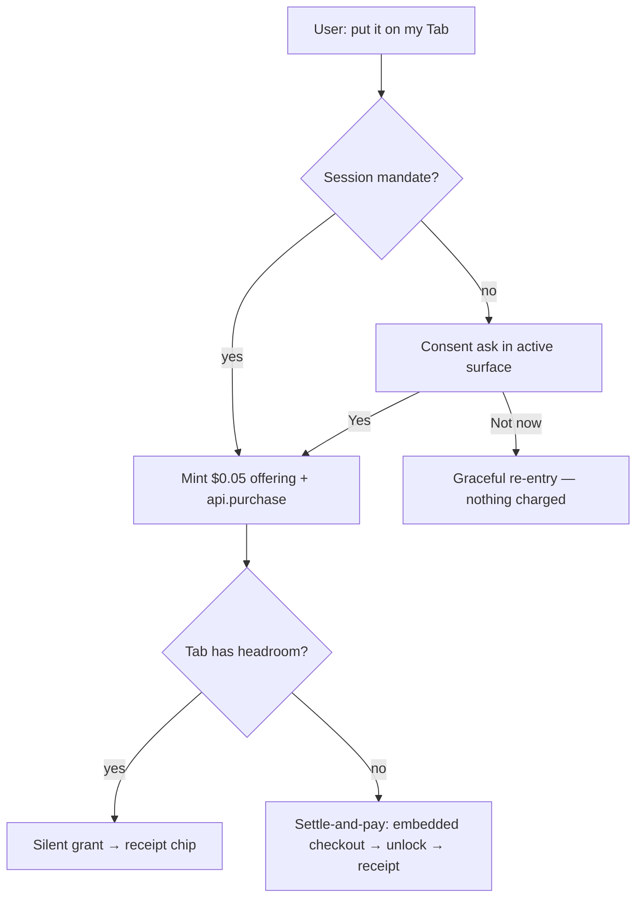

# Agentic Payments — Flows & Architecture

**Status:** Shipped via consolidation PR (recover agentic payment fixes)  
**Audience:** Engineering, product, Supertab partnership  
**Copy inventory:** [SUPERTAB_COPY_REVIEW.md](SUPERTAB_COPY_REVIEW.md)

---

## Principle

Agent-driven commerce surfaces **designed user experiences**, not error fallbacks. Each situation (no mandate, headroom, no headroom, declined, already owned, connecting Tab) has its own copy and in-view action, rendered in the **active surface** (chat thread or open recipe sheet) identically in voice and text mode.

---

## On-Tab charge — two designed branches

- **Has headroom:** `api.purchase(onetimeOfferingId)` completes silently → app-asserted receipt chip.
- **No headroom** (`actionRequired`): interactive settle-and-pay via embedded Supertab checkout — a normal branch, not an error toast.
- **Declined / abandoned:** graceful message with re-entry; never silent.

---

## Agent Action Surface (Tier 1)

Today: a **portal** (`AgentActionSurfacePortal`) renders consent asks and purchase receipts above the recipe modal (`z-[10060]`), so voice sessions with an open sheet still show commerce UI. Consent still uses the global `spendMandateConsentGate` singleton; receipts use `purchaseReceiptStore`.

**Tier 2:** unify asks, notifications, and receipts into one view-agnostic store with a single `activeSurface` source of truth.

---

## Technical flow

1. Agent calls `request_supertab_unlock` → emits `spend_mandate_consent_requested` + `recipe_paywall_requested`.
2. Frontend blocks on consent gate until user taps Yes / Not now (portaled above modal).
3. On Yes: `POST /api/v1/spend-mandates` → `POST /api/v1/offerings/onetime` (backend mints $0.05) → `api.purchase(onetimeOfferingId)`.
4. On success: optimistic sync + webhook reconciliation; receipt chip in active surface.
5. Text chat sends `focused_recipe_backend_id` when the recipe sheet is open so the agent can call the unlock tool.

**Pricing authority:** backend `DEFAULT_RECIPE_PRICE_CENTS = 5`; frontend never invents offering ids.

---

## Use-case catalogue

| Situation | Experience |
|-----------|------------|
| No mandate yet | Consent ask |
| Mandate + headroom | Silent grant → receipt |
| No headroom | Settle-and-pay embedded checkout → receipt |
| Declined / abandoned | Graceful re-entry |
| Already owned / free | Skip purchase → cooking |
| Unlocking pending | Confirming state (NEU-654 poll) |
| Not connected to Tab | Connect-your-Tab onboarding |
| Session ceiling reached | Tier 2: raise / re-approve |
| Mandate revoked | Re-ask cleanly |

---

## Roadmap (Tier 3)

| Item | Linear |
|------|--------|
| Server-side ask FSM | NEU-670 |
| Voice verbal approval | NEU-671 |
| 30s undo window | NEU-672 |
| Trust hardening (verified token) | NEU-673 |
| Mandate management UX | NEU-674 |
| Webhook verify at $0.05 | NEU-668 |
| Voice turn latency (NEU-629 follow-up) | new issue |
| Live Supertab client | NEU-677 |
