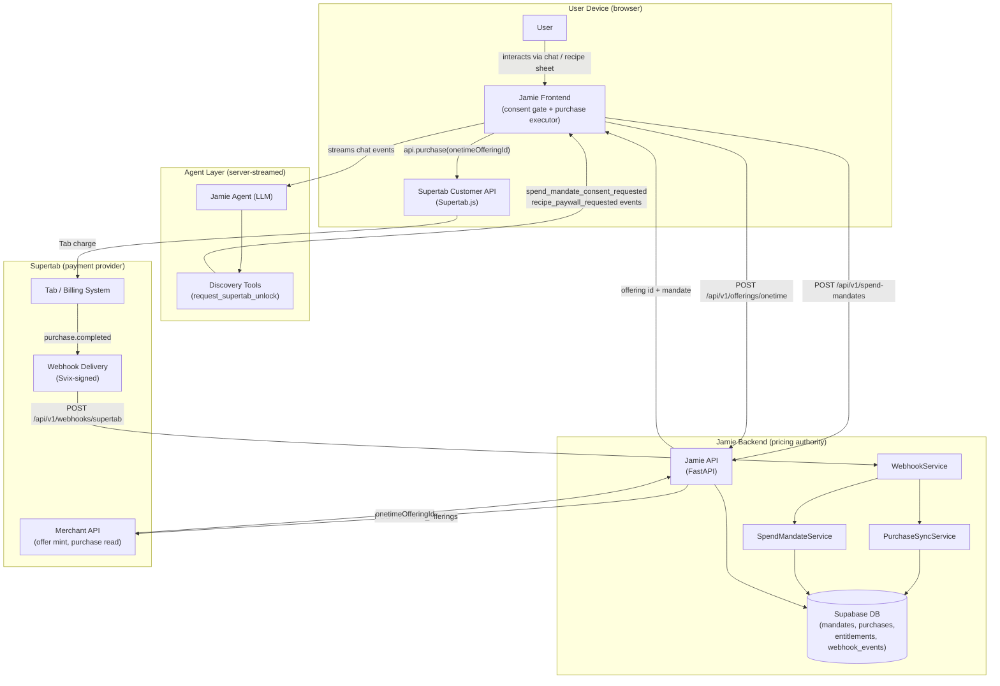
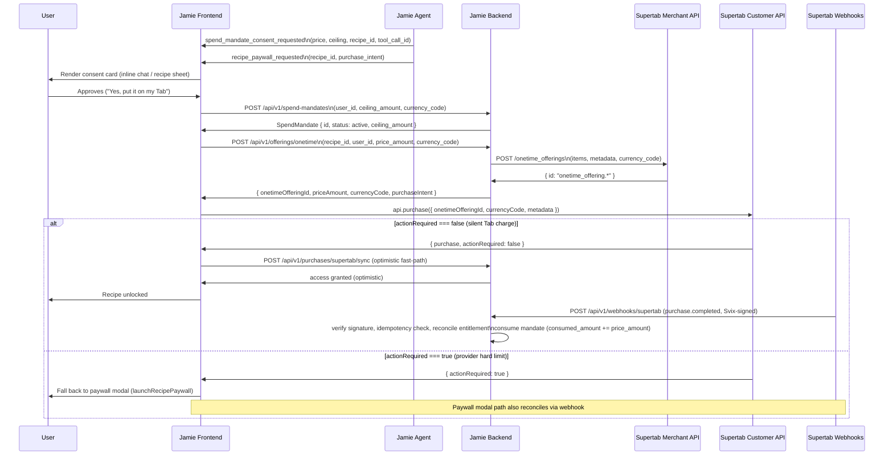

# Agentic Payments Architecture

**Status:** Working design document — Phase 1 implemented, Phases 2-3 roadmapped  
**Scope:** Reusable blueprint for AI-agent-initiated payments across products  
**Applies to:** Jamie Oliver AI (primary implementation), future agent products

---

## 1. Executive Summary

This architecture describes how an AI agent issues purchases on a user's behalf — silently, within explicitly granted bounds — without the user seeing a payment modal in the common case. The implementation delivers this for Jamie Oliver AI via Supertab, but the design is intentionally layered so the core protocol (consent gate, mandate service, offer-mint-purchase-reconcile flow) is portable to any product and any payment provider.

The central insight is that agentic commerce requires three distinct authorizations: the user's ongoing trust in the agent (identity), a bounded session grant allowing the agent to charge (spend mandate), and a concrete priced object to charge against (backend-minted offer). Keeping these three concerns separate — and making the agent responsible only for expressing intent, never for holding credentials or executing payment logic — is what makes the architecture trustworthy, auditable, and reusable.

The flow produces a fully silent purchase when a valid session spend mandate exists and the provider's own hard limit has headroom. When either constraint fails, the system degrades gracefully to the existing paywall modal. Entitlement grants are authoritative only from provider-verified webhooks; the optimistic client sync is a UX fast-path, not a source of truth.

---

## 2. Standards Alignment

We are not formally compliant with any external specification in Phase 1. The design is deliberately shaped to be AP2-aligned in pattern, enabling incremental adoption without a full rewrite.

### Agent Payments Protocol (AP2) mapping

| AP2 concept | Our implementation | Fidelity |
|---|---|---|
| **Intent mandate** — user grants the agent bounded spending authority | `SpendMandate`: ceiling, currency, session scope, revocable, states `active / exhausted / expired / revoked` | AP2-aligned in structure and semantics; not formally validated against the AP2 spec |
| **Cart mandate** — a concrete priced object the agent executes against | Backend-minted one-time offering (`POST /api/v1/offerings/onetime` → Supertab Merchant API) | AP2-aligned; Supertab's one-time offering plays the role of a cart manifest |
| **Execution** — agent performs the purchase within mandate bounds | `Supertab.api.purchase({ onetimeOfferingId })` called by the client, not the agent | Execution delegated to the client because Supertab's Customer API is browser-scoped; the agent expresses intent, the client executes |
| **Verifiable settlement** — authoritative, tamper-proof purchase record | Svix-verified `purchase.completed` / `onetime_offering.purchasing_completed` webhooks; idempotent via Svix message id | AP2-aligned; webhook verification replaces client-trust grant |
| **Capability discovery** — external agents can discover commerce surfaces | `GET /api/v1/commerce/capabilities` returns a `jamie-commerce-v1` manifest tagged `compatible_with: ["ucp-draft", "ap2-session-mandate"]` | Partial — manifest is structured for UCP/MCP consumption but not yet registered with any external agent directory |

### What we do not implement

- The full AP2 message format or signed intent envelopes.
- UCP payment-handler registration or credential exchange.
- x402 payment primitives or HTTP-native payment negotiation.
- Cross-agent capability brokerage.

The architecture does not over-claim compliance. It is AP2-aligned in pattern: intent before execution, mandate before charge, webhook-authoritative settlement.

---

## 3. Actors and Trust Boundaries

### Actor definitions

- **User** — the authenticated Supertab customer interacting via chat, recipe sheet, or voice.
- **Jamie agent** — the LLM plus its tool calls. It decides when to attempt an unlock; it emits structured events; it never holds payment credentials and never executes purchases directly.
- **Jamie frontend** — the browser client. Holds the Supertab Customer API session (auth is browser-scoped). Renders consent surfaces. Executes `api.purchase` within mandate bounds. Optimistically syncs.
- **Jamie backend** — FastAPI service. Acts as the pricing authority: mints one-time offerings, manages mandate state, verifies webhooks, grants entitlements. Issues Merchant API calls server-to-server.
- **Supertab (Customer API)** — browser-facing; handles user identity and Tab charging. Auth is cookie/token-scoped to the user's browser session.
- **Supertab (Merchant API)** — server-facing; mints one-time offerings, provides authoritative purchase reads. Uses OAuth2 client-credentials tokens issued to Jamie backend.
- **Supertab (webhooks)** — provider-push; delivers `purchase.completed` events signed by Svix. This is the authoritative settlement record.

### Trust boundary rules

1. The agent emits intent events; it does not call payment APIs.
2. The frontend executes purchases but only within a backend-validated mandate and against a backend-minted offer id.
3. The backend is the only actor that mints offerings, verifies webhooks, and writes entitlements.
4. Entitlement is not granted from client-reported outcomes alone (target state; see Section 9 for current gap).



---

## 4. The Consent and Purchase Protocol

The event contract is designed to be provider-agnostic. The agent tool emits structured events; the frontend interprets them through a consent gate that is independent of the payment provider.

### Event contract

**`spend_mandate_consent_requested`** — emitted by `request_supertab_unlock` tool result processing. Fields:

```
backend_recipe_id   string    internal recipe id
price_amount        int       cents (e.g. 5 for $0.05)
currency_code       string    ISO 4217 (e.g. "USD")
ceiling_amount      int       cents; min(1000, price_amount) in current impl
tool_call_id        string    correlates event to the originating tool call
response_id         string    correlates to the agent response turn
```

**`recipe_paywall_requested`** — emitted alongside the consent event. Fields:

```
backend_recipe_id   string
purchase_intent     object    neutral purchase intent payload from commerce_capability.py
tool_call_id        string
response_id         string
```

The `tool_call_id` / `response_id` correlation allows the frontend to associate the consent card with the specific message turn that triggered it, enabling correct rendering in streamed chat.

### Full protocol sequence



**Key invariants:**

- The agent never holds payment credentials. It emits structured intent events.
- The backend is the sole actor that calls the Merchant API and writes entitlements.
- The client executes `api.purchase` within mandate bounds; it does not invent offer ids.
- Webhook reconciliation is authoritative. The optimistic sync fast-path is a UX optimization, not a trust path.

---

## 5. Mandate Lifecycle

### States

| State | Meaning | Transitions |
|---|---|---|
| `active` | Within session window, consumed < ceiling | → `exhausted` (consumed >= ceiling), → `expired` (session ends), → `revoked` (user action) |
| `exhausted` | Ceiling fully consumed | Terminal for this mandate; user must re-authorize |
| `expired` | Session window elapsed (`expires_at` passed) | Terminal |
| `revoked` | User explicitly disabled via My Tab surface | Terminal |

### Ceiling semantics

`ceiling_amount` is the total cumulative spend the agent is authorized to charge this session. `consumed_amount` tracks settled spend: it is incremented by `WebhookService._maybe_consume_mandate` on each verified settlement event, not on purchase initiation.

Pre-purchase, the frontend checks `ceiling_amount - consumed_amount >= price_amount` before calling `api.purchase` (client-side guard). The server enforces this again at offering-mint time (`can_charge` in `SpendMandateService`). Neither check is a hard payment-system guarantee — the backend is the pricing authority, not the payment system.

### Relation to Supertab Tab limit

The Supertab Tab limit is a provider-enforced hard ceiling on the user's rolling Tab balance. When it is reached, `api.purchase` returns `actionRequired: true`. This is independent of the Jamie mandate ceiling. Both must allow a charge for a silent purchase to succeed:

```
silent purchase allowed = mandate.active AND mandate.headroom >= price AND NOT provider.actionRequired
```

If the mandate allows but the provider requires action, the system falls back to the paywall modal. The mandate is not consumed in this case (no webhook settlement event is generated for a modal-path purchase unless the user completes it).

### Revocability

`DELETE /api/v1/spend-mandates/current` revokes the active mandate. This is surfaced from the My Tab panel. On revocation, `SpendMandateService.revoke_current_mandate` calls `repository.revoke_active_mandates`, setting all active mandates for the user to `revoked`.

---

## 6. Surface Independence Pattern

The consent gate is implemented as a module-level singleton promise store (`spendMandateConsentGate.ts`) that holds at most one pending consent at a time. This decouples the decision point (agent tool result, anywhere in the app) from the rendering surface (chat thread, recipe sheet pane, or future voice confirmation).

### Gate API

```typescript
requestSpendMandateConsent(params)   // → Promise<boolean>; blocks until resolved
resolveSpendMandateConsent(approved) // → void; resolves the pending promise
getPendingSpendMandateConsent()      // → params | null; for renderers to snapshot
subscribeSpendMandateConsent(fn)     // → unsubscribe; for renderers via useSyncExternalStore
```

### Surface renderers

Each surface subscribes to the store and renders a thin UI that calls `resolveSpendMandateConsent(true/false)`:

| Surface | Component | Trigger |
|---|---|---|
| Chat thread inline | `SpendMandateConsentInline` | Rendered when `spend_mandate_consent_requested` event arrives; appears inside the message stream |
| Recipe sheet pane | `SpendMandateConsentInline` (with `backendRecipeId` filter) | Rendered in the recipe detail panel for recipe-specific consent |
| Voice (Phase 2) | Verbal confirmation mapped to `resolveSpendMandateConsent` | Agent reads price/ceiling aloud; user says yes/no |

All renderers resolve the same promise. The purchase flow is gated on that resolution regardless of which surface the user responded on. This is the pattern that makes the same agent action work identically across chat, recipe sheet, and voice.

---

## 7. Portability Blueprint

To adopt this architecture in another product or agent, implement the following. This is a checklist, not a size estimate.

**Event contract**

- [ ] Define `spend_mandate_consent_requested` event with: `price_amount`, `currency_code`, `ceiling_amount`, content id, `tool_call_id`, `response_id`.
- [ ] Define a paywall/unlock event for the fallback path.
- [ ] Both events emitted from the agent tool result processor, not from the LLM directly.

**Mandate service + endpoints**

- [ ] `SpendMandate` data model: `user_id`, `ceiling_amount`, `currency_code`, `consumed_amount`, `status`, `expires_at`.
- [ ] `POST /mandates` — create/replace active mandate.
- [ ] `GET /mandates/current` — read active mandate.
- [ ] `DELETE /mandates/current` — revoke.
- [ ] `can_charge(user_id, amount)` — ceiling check.
- [ ] `consume_mandate(mandate, amount)` — called on verified settlement, not on purchase initiation.

**Provider adapter interface**

Each payment provider is one adapter implementing:

- [ ] `mint_offer(price, currency, metadata)` → `offer_id` — Merchant API or equivalent.
- [ ] `purchase(offer_id, currency, user_context)` → `{ actionRequired, purchase }` — Customer API or equivalent.
- [ ] `verify_webhook(payload, headers)` → verified event body — signature verification.
- [ ] `map_event(body)` → `ReconcileEvent` — normalize provider event to internal shape.
- [ ] `check_entitlement(content_key, user_context)` → `{ hasEntitlement }` — prior purchase check.

**Consent gate + surface renderers**

- [ ] Singleton gate store: `request / resolve / getPending / subscribe`.
- [ ] At least one renderer per surface in the product (inline card, pane widget, or voice callback).
- [ ] All renderers call the same `resolve` function.

**Capability manifest**

- [ ] `GET /commerce/capabilities` returns a manifest with `protocol`, `compatible_with`, capability list with `requires_mandate`, `endpoints` map.
- [ ] Manifest is stable and versioned; external agents can discover it.

---

## 8. Phase Roadmap

### Phase 1 — Current implementation

Text chat + recipe sheet consent surfaces. Silent Tab purchase via `Supertab.api.purchase` with backend-minted one-time offerings (`onetimeOfferingId`). Svix-verified webhook reconciliation as authoritative entitlement grant. Optimistic sync retained as UX fast-path. Mandate lifecycle management (create, check, consume on settlement, revoke). Commerce capability manifest at `GET /api/v1/commerce/capabilities`.

**Current vs. target note:** The one-time offering migration in `supertab.ts` (`purchaseRecipeOnTab`) is actively in progress. The static offering path (`offeringId`) has been replaced with backend-minted `onetimeOfferingId`. User identity is still resolved from a client-supplied `user_id` on the mandate and offering endpoints — the backend does not yet verify the Supertab token. This is the primary trust gap (see Section 9).

### Phase 2 — Voice consent + trust hardening

Voice consent end-to-end: the agent reads price and ceiling aloud; the user's verbal yes/no resolves the same consent gate promise via a voice-input handler. No new backend protocol is needed — the gate is already surface-agnostic.

Backend trust hardening: the frontend sends the Supertab access token (or a derived exchange token) with mandate and offering requests. The backend verifies the token via `SupertabTokenVerifier` and resolves `user_id` from the verified subject, not from the client-supplied field. This makes silent grants non-spoofable. The PRD labels this a hard prerequisite for paid silent grants.

Settlement UX for `actionRequired`: when the provider returns `actionRequired: true`, display a lightweight inline card explaining why (Tab limit reached, payment method needed) with a direct link to the Supertab Tab management URL, instead of the current modal fallback.

### Phase 3 — Cross-product extraction

Extract the mandate service, webhook service, and provider adapter interface into a shared library. Implement a second provider adapter (non-Supertab) to validate the abstraction boundary. Surface the capability manifest in an external agent directory or as an MCP tool registration, enabling external agents to transact against Jamie commerce capabilities without bespoke integration.

---

## 9. Known Gaps and Risks

**Client-supplied user_id (trust gap — high priority)**  
The mandate creation (`POST /api/v1/spend-mandates`), offering mint (`POST /api/v1/offerings/onetime`), and optimistic sync endpoints currently accept `user_id` as a body or query parameter without verifying the caller's identity. A malicious or misconfigured client can submit any `user_id`. Mitigation is Phase 2 trust hardening: verify the Supertab token server-side and reject requests where the token subject does not match the supplied id. Until this ships, silent grant paths must not be treated as fully trusted.

**Optimistic sync vs. webhook race**  
`POST /api/v1/purchases/supertab/sync` runs immediately after `api.purchase` returns. The authoritative webhook may arrive seconds to minutes later, or not at all in failure scenarios. If the optimistic sync grants access but the webhook later contradicts it (e.g. purchase abandoned), the system may have granted access without settlement. Mitigation: treat the optimistic sync as a read-accelerator only; always require the webhook for billing-sensitive decisions. Add a reconciliation job to detect sync-without-webhook cases.

**Mandate ceiling enforced client-side pre-purchase**  
The ceiling check before `api.purchase` runs in the frontend (`ensureSpendMandateForAgenticPurchase`). The backend enforces it at offer-mint time. Neither is a payment-system-level guarantee — Supertab's own Tab limit is the only hard provider backstop. If a client bypasses the ceiling check, the mandate `consumed_amount` will still be updated on webhook settlement, but the pre-purchase guard was ineffective. Mitigation: the backend `can_charge` check at offer-mint time is the more reliable control; ensure it is enforced before returning `onetimeOfferingId`.

**Supertab test-mode constraints**  
In test mode, `api.purchase` behavior for `actionRequired` and entitlement grant may differ from production. The silent-charge path (`actionRequired === false`) must be validated empirically against a production Supertab account with a zero-balance Tab before Phase 1 is considered production-ready. Test-mode purchases do not trigger production webhooks; end-to-end webhook reconciliation must be tested against Supertab's staging environment or using Svix's test delivery tooling.

**Mandate consumed_amount lags actual spend**  
`consumed_amount` is incremented on webhook receipt, which may lag the purchase by seconds or minutes. During this window, a second agentic purchase request will see stale headroom and may be allowed through even if the ceiling has effectively been reached. For low-price items ($0.05 per recipe) this is an acceptable risk in Phase 1. For higher-priced items or higher ceilings, consider locking the mandate optimistically on purchase initiation and releasing the lock on webhook failure.

**Single provider coupling**  
The current implementation couples offering mint and purchase directly to Supertab. The `payment_provider` adapter interface in `webhook_service.py` abstracts webhook processing, but `supertab_merchant.py` is called directly from the offering endpoint. Phase 3 cross-product extraction should complete the adapter boundary so swapping or adding providers does not require changes to mandate or consent logic.
