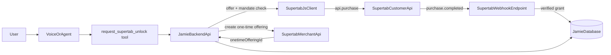
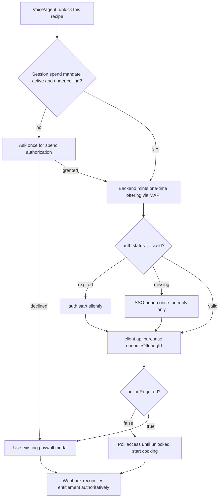

# Agentic Tab Payments PRD

## Document Status
- Status: Draft for product and engineering definition
- Product area: Jamie Oliver AI — voice & agentic commerce
- Focus: Modal-free Supertab Tab charging for logged-in users, driven by voice and AI agents
- Depends on: [`SUPERTAB_MONETIZATION_PRD.md`](./SUPERTAB_MONETIZATION_PRD.md), [`SUPERTAB_FOUNDATIONS_EXECUTION_PLAN.md`](./SUPERTAB_FOUNDATIONS_EXECUTION_PLAN.md)

## Executive Summary
Jamie Oliver AI already monetizes the guided cooking experience through Supertab and can trigger checkout from voice. However, every purchase path today renders a Supertab UI surface (purchase button or paywall modal). For a true voice-first and agentic experience, a logged-in Supertab user should be able to say "put this on my tab" — or have Jamie's agent decide to unlock a recipe — and have the charge added to their Supertab Tab **without seeing a payment modal**.

This is achievable today with Supertab primitives we are not yet using:
- The **Customer API `purchase` method** (`Supertab.api.purchase`) charges an authenticated user's Tab directly and returns an `actionRequired` flag. When `actionRequired` is `false`, the Tab is charged silently with no UI.
- The **Merchant API One-Time Offering** endpoint lets the backend mint a priced, metadata-tagged offer on the fly that the agent/client then purchases.
- **Svix-verified webhooks** (`purchase.completed`, `onetime_offering.purchasing_completed`) let the backend treat the purchase as authoritative and grant entitlement server-side.

We will structure the implementation as **`authorize → create offer → execute → reconcile`**, mirroring AI-native commerce standards (Universal Commerce Protocol, Agent Payments Protocol). This keeps the MVP simple while leaving a clean path to expose Jamie's commerce as an agent-callable capability later.

The consent model for agentic charges is an **AP2-style session spend mandate**: the user authorizes once per session ("add cooking unlocks to my tab automatically, up to a limit"), after which charges under that ceiling are fully silent.

## Background And Current State

### What exists today
- Supertab integrated client-side via `@getsupertab/supertab-js` in [`apps/frontend/src/lib/supertab.ts`](../../apps/frontend/src/lib/supertab.ts).
- Three access states resolved server-side (`free` | `locked` | `owned`) in `apps/backend-search/recipe_search_agent/access_service.py`.
- Voice-triggered unlock via the `request_supertab_unlock` discovery tool, surfaced to the client as a `recipe_paywall_requested` event.
- Client-initiated reconciliation: `POST /api/v1/purchases/supertab/sync` runs after the Supertab UI `onDone` callback fires.

### Why the current approach cannot be modal-free
All three purchase paths depend on a rendered Supertab UI surface:
- `mountRecipePurchaseButton` (`supertab.ts` lines 435-538) renders `client.createPurchaseButton(...)` — an embedded widget the user taps.
- `launchRecipePaywall` (`supertab.ts` lines 614-671) calls `paywall.show()` — the Supertab modal.
- `clickVisibleJamieSupertabPurchaseButton` (`supertab.ts` lines 424-433) drives "voice" by performing a synthetic DOM `.click()` on the rendered widget, walking shadow roots. This still opens the modal and is brittle (depends on the widget's live DOM).

Reconciliation is also client-trust based: the backend grants access from a client-supplied `user_id` and a client-reported purchase outcome. There is no webhook, and the Supertab token is not verified on the backend.

## Problem Statement
We need a logged-in Supertab user to be able to add a paid recipe to their Tab through voice or an autonomous agent step, with no payment modal in the common case, while keeping entitlement grants trustworthy and auditable. The current architecture cannot do this because:
- it has no server-to-server Merchant API integration,
- it has no silent client purchase call,
- it has no webhook-based reconciliation, and
- it trusts client-supplied identity and purchase outcomes.

## Product Goals
- Allow a logged-in Supertab user to unlock a recipe by voice or agent with no payment modal when their Tab can absorb the charge.
- Make the payment modal the **exception path**, shown only when Supertab reports `actionRequired` (tab limit reached, payment method needed, etc.).
- Make entitlement grants authoritative via verified webhooks, independent of client claims.
- Introduce an explicit, auditable per-session spend authorization so agentic charges are intentional, never surprising.
- Structure the flow so it can later be exposed as a UCP/AP2/MCP-compatible commerce capability.

## Non-Goals
- Replacing Supertab as the payment/identity provider.
- Implementing the full UCP/AP2 specification or cross-agent commerce in this phase (we make the architecture compatible, not compliant).
- Monetizing discovery/chat itself.
- Building a Jamie-native payment instrument or wallet.
- Changing the freemium baseline or the "monetize at commitment" principle from the Monetization PRD.

## Product Principles
- Charge silently when trust and headroom exist; show payment UI only when Supertab requires it.
- The user authorizes the agent's spending explicitly and can see/limit it.
- The merchant (Jamie backend) is the source of truth for entitlement, reconciled from verified webhooks.
- Separate authorization (intent/mandate) from offer creation from execution from reconciliation.
- Degrade gracefully: any failure in the silent path falls back to the existing paywall modal, never to a locked dead-end.

## Core Mechanism

### Supertab Tab model
Supertab is a "buy now, pay later on a Tab" system. The `PurchaseStatus` enum documents the behavior:
- `PAY_LATER on Tab` → the purchase's own status (typically `pending` against the Tab, entitlement granted, settled later when the Tab threshold is reached).
- `PAY_NOW in a paid Tab` → `completed`.
- `PAY_NOW in an unpaid Tab` → `pending` until payment completes.

This is why a logged-in user with headroom under their Tab limit can be charged **without any payment step**: the unlock is added to the Tab and only collected later.

### The silent purchase call (Customer API)
`Supertab.api.purchase` (auth required) is the primitive we will adopt:

```typescript
const result = await supertabClient.api.purchase({
  onetimeOfferingId: "onetime_offering.…", // or offeringId for predefined offerings
  currencyCode: "USD",                       // must match the user's Tab currency
  metadata: { jamieUserId, recipeId, contentKey },
});

// result shape:
// {
//   purchase: { status: "completed" | "pending" | "abandoned", id, entitlementStatus, … },
//   actionRequired: boolean,
//   actionRequiredDetails: { next: string, reason: string } | null,
//   rejectionReason?: string,
//   purchaseOutcome?: string,
// }
```

Branch point:
- `actionRequired === false` → Tab charged silently. Grant access and proceed. **No modal.**
- `actionRequired === true` → Supertab needs user intervention (e.g. Tab limit, payment method). Fall back to `createPaywall(...)` + `paywall.show()`. **This is the only place a modal appears.**

This is conceptually equivalent to a Stripe PaymentIntent resolving to `succeeded` vs `requires_action`. Supertab has no literal "PaymentIntent" object; the server-side equivalent is the **One-Time Offering**, and the realized charge is the **Purchase**.

### One-Time Offerings (Merchant API)
The backend mints offers server-to-server so the agent can act on a concrete, priced object:

```
POST https://tapi.supertab.co/mapi/onetime_offerings
Headers: Authorization: Bearer <mapi token>, x-supertab-client-id, x-api-version: 2025-04-01
Body:
{
  "currency_code": "USD",
  "metadata": { "content_key": "recipe:<slug>:cook", "recipe_id": "<id>", "jamie_user_id": "<id>" },
  "items": [ { "price_amount": 199, "description": "Cook with Jamie: <recipe name>" } ]
}
→ 201 { id: "onetime_offering.…", status: "new", price, items: [...] }
```

Merchant API auth is OAuth2 **client-credentials** (scopes `mapi:read mapi:write`) against `https://merchant-auth.supertab.co/oauth2/token`. Tokens expire and must be cached + refreshed.

## Authentication & Identity Strategy

### Two distinct auth surfaces
- **Customer API (browser, on behalf of the user):** handled by Supertab.js. `auth.status` is `missing | expired | valid`. `auth.start({ silently: true })` refreshes an existing session without a popup and returns `null` for unknown users. Only a brand-new login requires the SSO popup — and that is an **identity** step, not a payment step.
- **Merchant API (backend, server-to-server):** client-credentials token, used to mint offerings and read authoritative purchase status.

### Backend trust hardening (required)
Today `user_id` is accepted as an unauthenticated query/body param. Before silent charging can grant paid access safely:
- The frontend must send the Supertab access token (or a trusted exchange of it) to the backend.
- The backend must verify the Supertab token and resolve the Jamie user from the verified subject, not from a client-supplied id.
- Entitlement grants become webhook-authoritative; the client `sync` call becomes an optimistic fast-path only.

## Consent Model: Session Spend Mandate (AP2-style)

### Rationale
Agentic charging must be intentional and auditable. We adopt an Agent Payments Protocol-style mandate scoped to a session, instead of fully silent-by-default or confirm-every-purchase.

### Behavior
- On the **first** agentic/voice unlock attempt in a session, Jamie asks once: e.g. "Want me to add cooking unlocks straight to your tab, up to £10 this session?"
- On consent, Jamie stores a **spend mandate**: `{ userId, ceilingAmount, currency, grantedAt, expiresAt (session-scoped), consumedAmount }`.
- Subsequent unlocks whose cumulative cost stays under the ceiling execute **fully silently** via `api.purchase`.
- When a charge would exceed the ceiling, Jamie asks again (re-authorize / raise ceiling) before charging.
- The mandate is visible and revocable from the My Tab surface.

### Mandate states
- `active` — within session window and under ceiling.
- `exhausted` — ceiling consumed; requires re-authorization.
- `expired` — session window passed.
- `revoked` — user turned it off.

### Relationship to Supertab Tab limit
The Supertab Tab limit is a hard backstop enforced by Supertab (manifesting as `actionRequired: true`). The Jamie mandate is a softer, user-facing, agent-scoped ceiling layered on top. Both must pass for a silent charge.

## Architecture Overview



## Proposed System Flow



## API And Service Contracts To Define

### New backend endpoints (backend-search)
- `POST /api/v1/offerings/onetime`
  - Auth: verified Supertab token.
  - Input: `recipe_id` (or slug).
  - Action: look up/seed `RecipeOffering`, call MAPI `POST /onetime_offerings` with `content_key` metadata, return `{ onetimeOfferingId, priceAmount, currencyCode, contentKey }`.
- `POST /api/v1/webhooks/supertab`
  - Public; verifies Svix signature using the per-endpoint signing key.
  - Handles `purchase.completed` and `onetime_offering.purchasing_completed` (version `2025-04-01`).
  - Resolves Jamie user + recipe from purchase/offering `metadata.content_key` and writes `purchases` + `entitlements` (reuse `purchase_sync_service.py`).
- `POST /api/v1/spend-mandates`
  - Create/refresh a session spend mandate for the verified user.
- `GET /api/v1/spend-mandates/current` and `DELETE /api/v1/spend-mandates/current`
  - Read and revoke the active mandate.
- Existing `POST /api/v1/purchases/supertab/sync` is retained as an **optimistic fast-path** but is no longer the source of truth.

### Frontend (supertab.ts) additions
- `purchaseRecipeOnTab(access): Promise<TabPurchaseOutcome>`
  - Ensure `auth.status === 'valid'` (silent refresh; SSO popup only for unknown users).
  - Request a one-time offering id from the backend.
  - Call `client.api.purchase({ onetimeOfferingId, currencyCode, metadata })`.
  - On `actionRequired === false`: reuse `pollRecipeAccessUntilUnlocked` then resolve.
  - On `actionRequired === true` or any error: fall back to `launchRecipePaywall(access)`.
- Mandate-aware orchestration wrapper used by both voice and tap, replacing reliance on `clickVisibleJamieSupertabPurchaseButton`.

### Merchant client (backend-search)
- Client-credentials token acquisition + caching/refresh.
- `create_onetime_offering(currency, items, metadata)`.
- `get_onetime_offering(id)` / purchase status read (`mapi:read`) for reconciliation fallback.

## Data Model Additions
Building on the existing Supertab foundations schema:

### `SpendMandate`
- `id`
- `userId`
- `ceilingAmount`
- `currencyCode`
- `consumedAmount`
- `status` (`active`, `exhausted`, `expired`, `revoked`)
- `source` (`voice`, `agent`, `manual`)
- `grantedAt`
- `expiresAt`
- `createdAt`
- `updatedAt`

### `Purchase` (extend if needed)
- ensure `onetimeOfferingId`, `providerPurchaseId`, `paymentRequired` (maps to `actionRequired`), and `providerPayload` are captured.

### Webhook idempotency
- `WebhookEvent` (or equivalent) table keyed by Svix message id to dedupe redelivery.

## Standards Alignment (UCP / AP2 / x402)
We are not implementing these specs in this phase, but we align the design so adoption is incremental:
- **Separation of intent and execution (AP2):** the `SpendMandate` is our analog of an AP2 Intent/Cart Mandate — an explicit, auditable user authorization the agent carries. The One-Time Offering is the concrete cart; `api.purchase` is execution.
- **Merchant-authoritative settlement:** entitlement is granted from verified webhooks, never from agent/client claims — consistent with UCP's payment-handler separation and AP2's verifiable settlement.
- **Capability shape (UCP/MCP):** `POST /api/v1/offerings/onetime` + a purchase action is structured so it can later be surfaced as an MCP tool or UCP Checkout capability with a REST/MCP binding, enabling external agents to transact against Jamie.
- **Future x402/instrument flexibility:** keeping payment execution behind the offer/mandate abstraction means new instruments or handlers can be added without changing the agent-facing contract.

## Rollout Plan

### Phase 1: Backend foundation (Merchant API + webhooks + trust)
- Add Merchant API client (client-credentials token, create one-time offering).
- Add `POST /api/v1/offerings/onetime`.
- Add Svix-verified `POST /api/v1/webhooks/supertab`; make webhooks the authoritative entitlement grant; add idempotency.
- Verify Supertab token on identity/access/offering/mandate endpoints; stop trusting client-supplied `user_id` for paid grants.

### Phase 2: Modal-free client purchase
- Implement `purchaseRecipeOnTab` using `client.api.purchase` with the `actionRequired` branch and paywall fallback.
- Validate empirically against the test client: confirm silent charge behavior for a fresh authenticated Tab vs. one needing a payment method.

### Phase 3: Voice & agentic wiring + spend mandate
- Replace the synthetic-click voice path with a direct call to `purchaseRecipeOnTab`.
- Implement `SpendMandate` create/read/revoke + the one-time per-session authorization prompt.
- Wire text chat auto-checkout (currently only voice auto-opens checkout).
- Surface mandate status and revocation in My Tab.

### Phase 4: Standards-readiness (optional/next)
- Expose offer + purchase as an MCP tool / UCP-compatible capability carrying the spend mandate, enabling external agents.

## Analytics And Observability
Track:
- agentic unlock requested
- spend mandate prompted / granted / declined / exhausted / revoked
- one-time offering created
- silent purchase succeeded (`actionRequired=false`)
- purchase required action (`actionRequired=true`) and reason
- paywall fallback shown
- webhook received / verified / duplicate
- entitlement granted via webhook vs. optimistic sync

Correlate by: internal user id, Supertab subject id, recipe id, offering id, one-time offering id, purchase id, mandate id, voice/chat session id.

## Risks
- **Silent-charge behavior assumptions:** exact `actionRequired` behavior for fresh/zero-balance authenticated Tabs must be validated against the test client before relying on it.
- **Webhook latency:** entitlement may lag the purchase call; `pollRecipeAccessUntilUnlocked` plus an optimistic client sync mitigates perceived delay.
- **Token verification gap:** until backend token verification ships, silent grants would be spoofable — Phase 1 trust hardening is a hard prerequisite for paid silent grants.
- **Currency mismatch:** `api.purchase` fails if `currencyCode` differs from the user's Tab currency; resolve currency from `retrieveCustomer().tab.currency`.
- **Consent surprise:** without the mandate prompt, autonomous charges could feel non-consensual; the session mandate is the guardrail.
- **Provider coupling:** retain internal entitlement records (already a Monetization PRD principle) so the agentic layer is not over-coupled to Supertab.

## Open Questions
- Default session mandate ceiling and window (e.g. £10 / session, expires with the voice/chat session)?
- Should the mandate persist across sessions for returning users, or always re-prompt per session?
- Do we want per-purchase voice confirmation as an optional stricter mode alongside the session mandate?
- Should text chat use the same silent-on-tab flow, or keep an explicit confirm step for non-voice surfaces?
- How much of the offering catalog should be pre-created vs. minted on the fly as one-time offerings?

## Source References
- Current Supertab orchestration: [`apps/frontend/src/lib/supertab.ts`](../../apps/frontend/src/lib/supertab.ts)
- Discovery agent unlock tool: `apps/backend-search/recipe_search_agent/discovery_tools.py`
- Tool-result events: `apps/backend-search/recipe_search_agent/tool_result_events.py`
- Purchase sync service: `apps/backend-search/recipe_search_agent/purchase_sync_service.py`
- Access service: `apps/backend-search/recipe_search_agent/access_service.py`
- Monetization PRD: [`SUPERTAB_MONETIZATION_PRD.md`](./SUPERTAB_MONETIZATION_PRD.md)
- Foundations plan: [`SUPERTAB_FOUNDATIONS_EXECUTION_PLAN.md`](./SUPERTAB_FOUNDATIONS_EXECUTION_PLAN.md)
- Supertab Merchant API — create one-time offering: https://docs.supertab.co/merchant-api/endpoints/create-onetime-offering
- Supertab Merchant API — authentication: https://docs.supertab.co/merchant-api/authentication
- Supertab Customer API — authentication: https://docs.supertab.co/customer-api/authentication
- Supertab.js — `Supertab.api` (purchase, checkEntitlement, retrieveCustomer): https://docs.supertab.co/supertab-js/reference/api
- Supertab.js — `Supertab.auth`: https://docs.supertab.co/supertab-js/reference/auth
- Supertab — consuming webhooks (Svix): https://docs.supertab.co/merchant-api/webhooks/consuming-webhooks
- Supertab — retrieve entitlement status: https://docs.supertab.co/customer-api/endpoints/retrieve-entitlement-status
- Google Universal Commerce Protocol (UCP): https://developers.google.com/merchant/ucp
- UCP under the hood: https://developers.googleblog.com/under-the-hood-universal-commerce-protocol-ucp/
